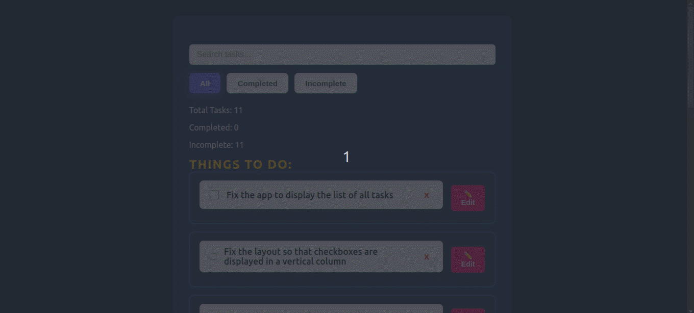

# 📝 React To-Do App Challenge



This is a functional To-Do Application built using ReactJS...

* Includes instructions to run the app locally.
* Provides a fix for the `ERR_OSSL_EVP_UNSUPPORTED` error.
* Explains what to do if someone wants to evaluate your submission manually.
* Mentions how to deploy (if needed).

---

```markdown
# 📝 React To-Do App Challenge

This is a functional To-Do Application built using ReactJS, SCSS, and a custom configuration (not using Vite or Create React App).
## 📁 Project Structure

```

react-todo-app-challenge/
│
├── config/              # Custom Webpack configs
├── public/              # Static public assets
├── scripts/             # Custom start script (start.js)
├── src/                 # Source code
│   ├── components/
│   │   ├── checkbox/
│   │   ├── filter-buttons/
│   │   ├── search-bar/
│   │   ├── stats-view/
│   │   ├── task-detail/
│   │   ├── todo-form/
│   │   ├── todo-list/
│   │   └── todo-results/
│   ├── app.jsx
│   ├── index.scss
│   └── todo-context.js
├── package.json
└── README.md

````

---

## 🧩 Tech Stack

- React.js
- SCSS for styling
- Webpack for bundling
- Babel for transpiling

---

## 🚀 Getting Started

### Prerequisites

Ensure you have **Node.js v16 or lower** installed.  
Node 17+ causes issues due to OpenSSL changes. If you're using Node 17+, 18+, or above, you can either:

### ✅ Option 1: Set Node Environment Variable (for Node 17+ or above)

```bash
# MacOS / Linux
export NODE_OPTIONS=--openssl-legacy-provider

# Windows CMD
set NODE_OPTIONS=--openssl-legacy-provider

# Windows PowerShell
$env:NODE_OPTIONS="--openssl-legacy-provider"
````

Then run:

```bash
npm install
npm start
```

---

### Option 2: Use Node v16 (Recommended)

If you use `nvm`, switch to Node 16:

```bash
nvm install 16
nvm use 16
npm install
npm start
```

---

## 📦 Scripts

To start the development server:

```bash
npm start
```

> This runs the custom script from the `scripts/start.js` file.

---

## ⚠️ Important Notes for Evaluator

* The project does **not** use `create-react-app` or `vite`, it uses a **custom Webpack setup**.
* If you face the following error:

```
Error: error:0308010C:digital envelope routines::unsupported
```

Run this before `npm start`:

```bash
export NODE_OPTIONS=--openssl-legacy-provider
```

Or switch to Node 16 using `nvm`.

---

## 📡 Deployment (Optional)

This project is **not created using Vite or CRA**, so automatic detection of entry point on platforms like **Vercel** may fail.
To deploy it manually:

1. Set the build command:

   ```bash
   npm run build
   ```
2. Set the output directory:

   ```bash
   dist
   ```
3. Set custom entry point in Vercel settings if needed:

   ```
   scripts/start.js
   ```

> However, local evaluation is preferred due to custom setup.


## 📋 Features

* Add, edit, delete tasks
* Task filters (completed, pending)
* Task detail view
* Real-time stats
* Styled using SCSS modules

---

## 🙋‍♂️ Author Note
If any issues occur while running the project, please try the **Node.js compatibility fix** mentioned above.
This ensures the project can be tested seamlessly regardless of your local setup.
